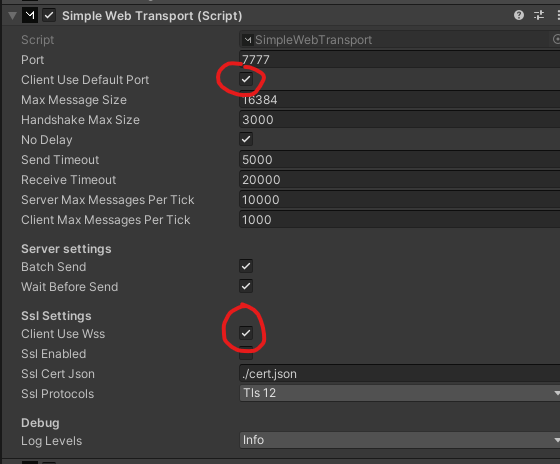

Scripts to run SimpleWebTransport with Mirror

## Set up transport for run behind Reverse proxy

### Server settings

Set `port` to port you want server to listen on for the reverse proxy, default is `7777`

### Client settings

Set `ClientUseDefaultPort` and `ClientUseWss` to true

