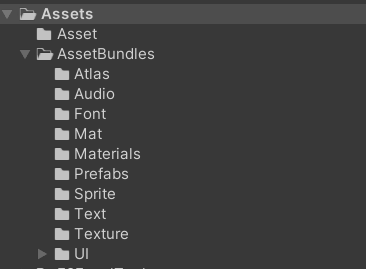
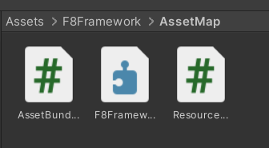
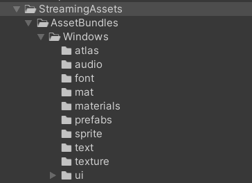

# F8AssetManager

[](https://opensource.org/licenses/MIT) 
[](https://unity.com) 
[]() 

## 简介（希望自己点击F8，就能开始制作游戏，不想多余的事）
Unity F8AssetManager资产加载组件。  
1.编辑器下：点击F8自动生成资产索引，AB名称，自动区分不同平台，清理多余AB和文件夹，Editor模式下减少开发周期。  
2.运行时：同步/异步加载单个资产，指定文件夹加载多个资产，自动判断是Resources/AssetBundle资产，加载Remote远程资产，获取加载进度，同步打断异步加载，相同资源同时加载。

## 导入插件（需要首先导入核心）
注意！内置在->F8Framework核心：https://github.com/TippingGame/F8Framework.git  
方式一：直接下载文件，放入Unity  
方式二：Unity->点击菜单栏->Window->Package Manager->点击+号->Add Package from git URL->输入：https://github.com/TippingGame/F8Framework.git  

### 初始化

1. 点击F8，自动获取Resources下的所有资产，生成索引（注意：资产名称唯一）  
          自动获取Assets/AssetBundles下的所有资产，生成索引（注意：资产名称唯一）  
          自动生成索引文件Assets/F8Framework/AssetMap目录下面  


2. 生成AssetBundles目录，自动赋予资产AB名称，打包AssetBundle，目录StreamingAssets/AssetBundles/Windows（不同平台例如Windows/iOS）  

3. 假如没有报错，就可以愉快地使用了  

### 代码使用方法
```C#
        /*----------所有加载均会自动判断是Resources资产还是AssetBundle资产----------*/
        
        /*-------------------------------------同步加载-------------------------------------*/
        
        GameObject go = AssetManager.Instance.Load<GameObject>("Cube");
        GameObject go2 = AssetManager.Instance.Load("Cube")as GameObject;
        GameObject go3 = AssetManager.Instance.Load("Cube", typeof(GameObject))as GameObject;
        //指定加载模式REMOTE_ASSET_BUNDLE，加载远程AssetBundle资产，需要配置REMOTE_ADDRESS = "http://127.0.0.1:6789/remote"
        GameObject go5 = AssetManager.Instance.Load<GameObject>("Cube", AssetManager.AssetAccessMode.REMOTE_ASSET_BUNDLE);
        //加载文件夹内资产
        AssetManager.Instance.LoadDir("NewFolder");
        
        /*-------------------------------------异步加载-------------------------------------*/
        
        AssetManager.Instance.LoadAsync<GameObject>("Cube", (go) =>
        {
            GameObject goo = Instantiate(go);
        });
        //协程
        var load = AssetManager.Instance.LoadAsyncCoroutine<GameObject>("Cube");
        yield return load;
        //加载文件夹内资产
        AssetManager.Instance.LoadDirAsync("NewFolder", () =>
        {
            
        });
        //协程
        var loadDir = AssetManager.Instance.LoadDirAsyncCoroutine("NewFolder");
        yield return loadDir;
        
        /*-------------------------------------其他功能-------------------------------------*/
        
        //获取加载进度
        float loadProgress = AssetManager.Instance.GetLoadProgress("Cube");
        //获取所有加载器的进度
        float loadProgress2 = AssetManager.Instance.GetLoadProgress();
        //同步卸载资产
        AssetManager.Instance.Unload("Cube", false);//根据AbPath卸载资产，如果设置为 true，将卸载目标依赖的所有资源，
        //异步卸载资产
        AssetManager.Instance.UnloadAsync("Cube", false, () =>
        {
            //卸载资产完成
        });
        
        //编辑器模式，无需打包AB
        AssetManager.Instance.IsEditorMode = true;
```


