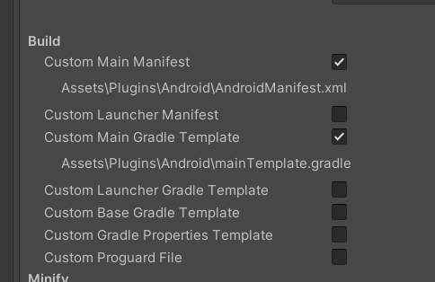
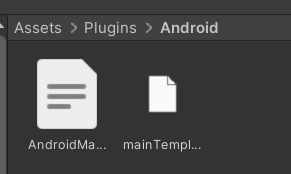

# F8 SDKManager

[](https://opensource.org/licenses/MIT) 
[](https://unity.com) 
[]() 

## 简介（希望自己点击F8，就能开始制作游戏，不想多余的事）
Unity F8 SDKManager组件，与原生平台交互，接入多个平台或者渠道SDK，登录/退出/切换/支付/视频广告/退出游戏/Toast  

## 导入插件（需要首先导入核心）
注意！内置在->F8Framework核心：https://github.com/TippingGame/F8Framework.git  
方式一：直接下载文件，放入Unity  
方式二：Unity->点击菜单栏->Window->Package Manager->点击+号->Add Package from git URL->输入：https://github.com/TippingGame/F8Framework.git  

### 代码使用方法
```C#
        // 启动SDK，平台id，渠道id
        FF8.SDK.SDKStart("1", "1");
        
        // 登录
        FF8.SDK.SDKLogin();
        
        // 登出
        FF8.SDK.SDKLogout();
        
        // 切换账号
        FF8.SDK.SDKSwitchAccount();
        
        // 加载视频广告
        FF8.SDK.SDKLoadVideoAd("1", "1");
        
        // 播放视频广告
        FF8.SDK.SDKShowVideoAd("1", "1");
        
        // 支付
        FF8.SDK.SDKPay("serverNum", "serverName", "playerId", "playerName", "amount", "extra", "orderId",
            "productName", "productContent", "playerLevel", "sign", "guid");
        
        // 更新用户信息
        FF8.SDK.SDKUpdateRole("scenes", "serverId", "serverName", "roleId", "roleName", "roleLeve", "roleCTime", "rolePower", "guid");
        
        // SDK退出游戏
        FF8.SDK.SDKExitGame();
        
        // 播放视频广告
        FF8.SDK.SDKToast("Native Toast");
```

### 安卓工程使用方法
* 勾选两个选项 Project Settings -> Player -> Publishing Settings -> Build  
  
------------------------------
* 勾选自动生成后替换这两个文件 [AndroidManifest.xml](https://github.com/TippingGame/F8Framework/blob/main/Tests/SDKManager/AndroidManifest.xml) 和 [mainTemplate.gradle](https://github.com/TippingGame/F8Framework/blob/main/Tests/SDKManager/mainTemplate.gradle)  

------------------------------
* 注意：假如前面两步没完成，打包到Android后会出现两个icon
------------------------------
* （可选）[UnityAndroidDemo.zip](https://github.com/TippingGame/F8Framework/blob/main/Tests/SDKManager/UnityAndroidDemo.zip) 为安卓工程，用作导出 [UnityAndroidDemo-release.aar](https://github.com/TippingGame/F8Framework/blob/main/Plugins/Android/UnityAndroidDemo-release.aar) 和 [AndroidManifest.xml](https://github.com/TippingGame/F8Framework/blob/main/Plugins/Android/AndroidManifest.xml)  
  1. 导出后，删除aar里 libs/classes.jar  
  2. 删除根目录的 classes.jar 里的 UnityPlayerActivity.java  


